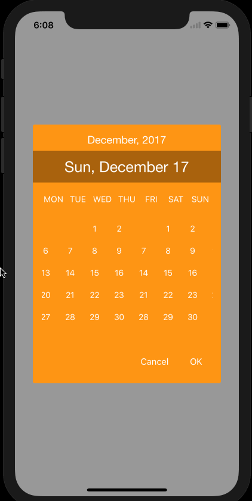

# CalendarPopUp
CalendarPopUp - JTAppleCalendar library

    

# Install
  **Run $ pod install in project directory.**
  
  **Open CalendarPopUp.xcworkspace and build.**

# Parameters 

  **In CellView.swift**
  
     * preDateSelectable: Bool
     * todayColor: UIColor
     * selectableDateColor: UIColor
     * selectedRoundColor: UIColor
  
  **CalendarPopUp.swift**
  
     *  startDate: Date
     *  endDate: Date

## Authors

[Oraz Atakishiyev](https://github.com/orazz)

## License

CalendarPopUp is available under the MIT license. See the LICENSE file for more info.
